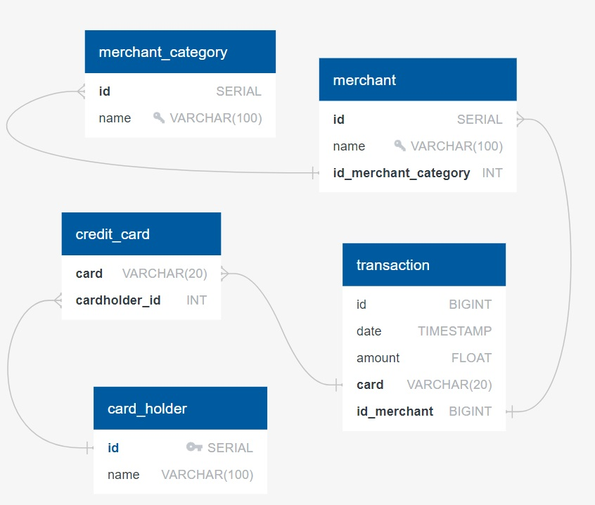
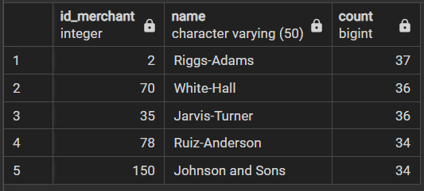
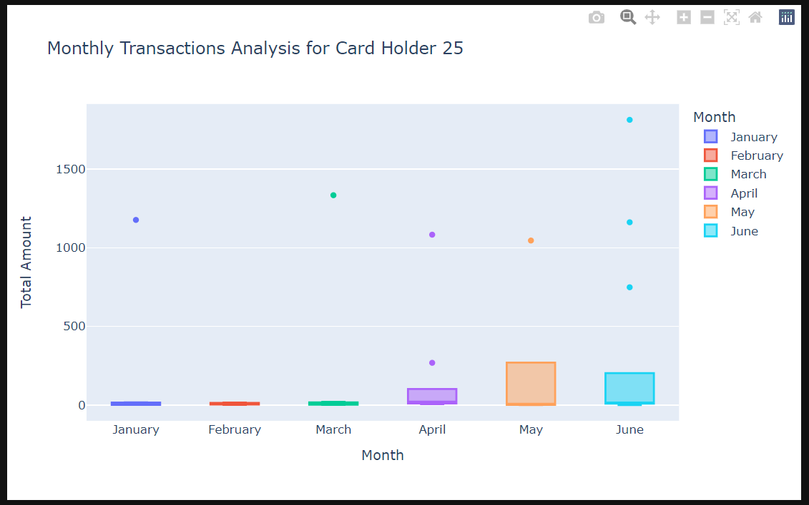

# SQL_Homework_Week_7
### SQL and Python Fraud Challenge 
#### By Joshua Woods 

#### Background on this homework:
Fraud is prevalent these days, whether you are a small taco shop or a large international business. While there are emerging technologies that employ machine learning and artificial intelligence to detect fraud, many instances of fraud detection still require strong data analytics to find abnormal charges.
I applied new SQL skills to analyze historical credit card transactions and consumption patterns in order to identify possible fraudulent transactions.
To accomplish this there were three main tasks:

Data Modeling:
Define a database model to store the credit card transactions data and create a new PostgreSQL database using a model.

Data Engineering: Create a database schema on PostgreSQL and populate your  database from the CSV files provided.

Data Analysis: Analyze the data to identify possible fraudulent transactions trends data, and develop a report of your observations.

#### Data Files

[card_holder.csv](./Resources/card_holder.csv)

[credit_card.csv](./Resources/credit_card.csv)

[merchant.csv](./Resources/merchant.csv)

[merchant_category.csv](./Resources/merchant_category.csv)

[transaction.csv](./Resources/transaction.csv)

#### ERD

### Response to CFO on Fraudulent activities
Part 1
Some fraudsters hack a credit card by making several small transactions (generally less than $2.00), which are typically ignored by cardholders.
How can you isolate (or group) the transactions of each cardholder?

* Count the transactions that are less than $2.00 per cardholder.\
  There are 350 transactions that are less than $2.00 [sql_view](./Resources/fraud_trans_all_less_than_2.00.csv)

* Is there any evidence to suggest that a credit card has been hacked? Explain your rationale.\
I cant see any evidence in this data as there are multiple names with less than $2 transactions, also lots of different card number and merchants.

* What are the top 100 highest transactions made between 7:00 am and 9:00 am?\
See SQL view file [sql_view_7-9](./Resources/fraud_trans_7-9_top_100.csv)

* Do you see any anomalous transactions that could be fraudulent?\
Yes i see two transactions with large float decimals, id 3163 and 2451.

* Is there a higher number of fraudulent transactions made during this time frame versus the rest of the day?\
No i see that there is also fraudulent transactions made during other parts of the day. [sql_view_all](./Resources/fraud_trans_all_day.csv)

* What are the top 5 merchants prone to being hacked using small transactions?\

[sql_view_top_5_merchants](./Resources/top_5_merchants_less_than_2.00.csv)

Part 2

Verify if there are any fraudulent transactions in the clients history. For privacy reasons, you only know that their cardholder IDs are 2 and 18.
* Using hvPlot, create a line plot representing the time series of transactions over the course of the year for each cardholder separately.

* Next, to better compare their patterns, create a single line plot that contains both card holders' trend data.

* What difference do you observe between the consumption patterns? Does the difference suggest a fraudulent transaction? Explain your rationale.\
You can see that Card Holder 18 has a few large anomalies compared to Card Holder 2 that would be worth exploring in more detail. Card Holder 2 doesn't seem to have any outliers like Card Holder 18.

The CEO of the biggest customer of the firm suspects that someone has used her corporate credit card without authorization in the first quarter of 2018 to pay quite expensive restaurant bills. Again, for privacy reasons, you know only that the cardholder ID in question is 25.
* Using hvPlot, create a box plot, representing the expenditure data from January 2018 to June 2018 for cardholder ID 25.

 
* Are there any outliers for cardholder ID 25? How many outliers are there per month?\
 There are 8 outliers in the box plot above. Avg of 1.33 per month. 
 
* Do you notice any anomalies? Describe your observations and conclusions.\
Apart from Feb there is an outlier each month with a transaction between $1000 and $1500 and in June there is also an extra large outlier of $1813. April also has an extra smaller outlier of $269. Therefor it looks like there has been some fraudulent activities happening on this credit card if the owner of the card doesn't usually pay for expensive restaurant bills. 

    
